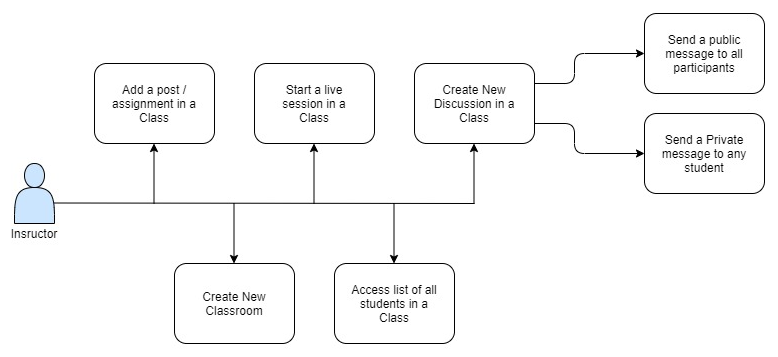
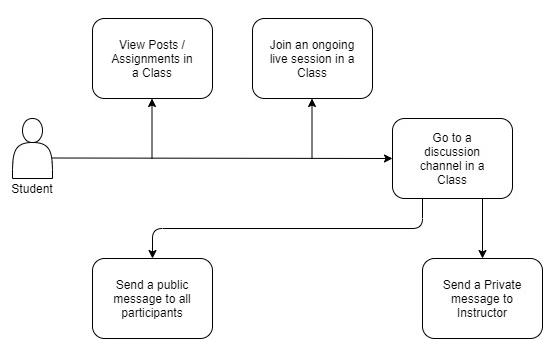
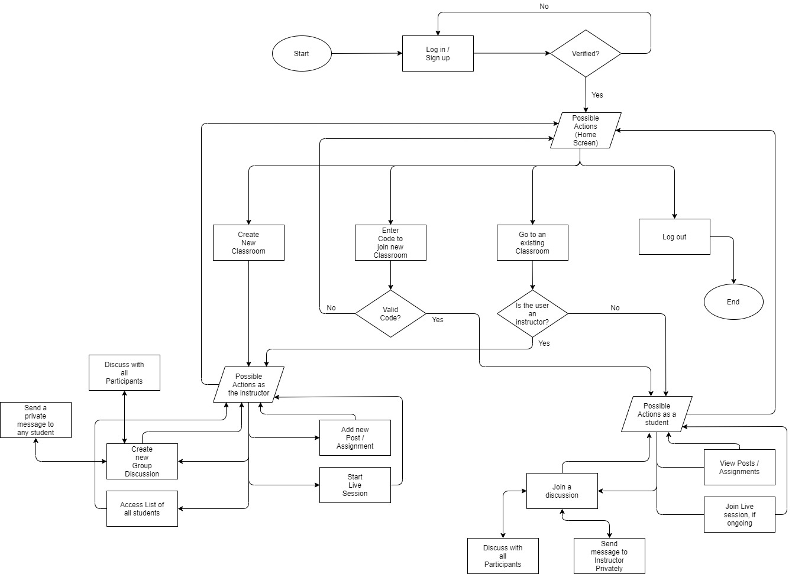
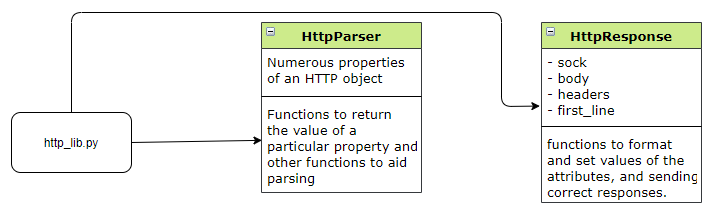
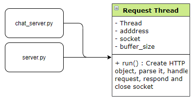
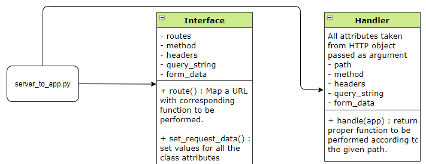
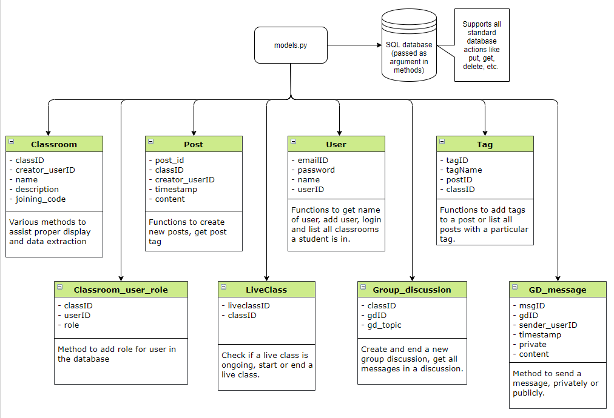
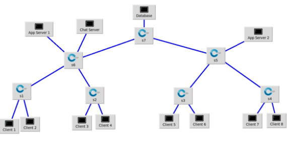

# Mini Classroom

This project was started as a part of our CS-433 Computer Networks course at IIT Gandhinagar, and was colaboratively made by [Dishank Goel](https://github.com/dishankgoel), [Harshit Kumar](https://github.com/harshitkumar825) and [Pushkar Mujumdar](https://github.com/pmujumdar27)

<!-- This is a Mini Classroom tool was made to mimic the functionalities of [Google Classroom](https://classroom.google.com) along with some additional features. -->

## Problem Statement

Design and implement Mini Classroom, a simple internet tool that mimics the functionalities of [Google Classroom](https://classroom.google.com/) and some additional features. Build your application on top of TCP.

## Directory Structure 📁
<!-- run tree command and update this later -->

```
Mini-Classroom
├── api.py
├── app.py
├── chat_client.py
├── chat_server.py
├── database
│   └── make_database.py
├── http_lib.py
├── mininet_tests.py
├── models.py
├── README.md
├── requirements.txt
├── server.py
├── server_to_app.py
├── start_app.sh
├── start_chat_app.sh
└── static
    ├── attendance.html
    ├── class.html
    ├── classrooms.html
    ├── create_class.html
    ├── css
    │   ├── chat.css
    │   ├── cover.css
    │   ├── offcanvas.css
    │   └── signin.css
    ├── discussion.html
    ├── error.html
    ├── group_discussions.html
    ├── img
    │   ├── class_icon.png
    │   └── login_icon.png
    ├── index.html
    ├── join_class.html
    ├── js
    │   └── offconvas.js
    ├── live_class.html
    ├── login.html
    ├── posts_by_tag.html
    ├── signup.html
    └── students.html
```

## Feature Checklist ✅
Basic Features - 
```
✅ Any Client is able to sign up and create an account with Mini Classroom
✅ Client can Login and Logout 
✅ Client can create a classroom and be the instructor of the class
✅ Client can join a classroom as a student by using the classroom code
✅ Only the Instructor can post updates to the classroom
✅ Students (and the instructor) can view posts on the classroom
```
Advance Features - 
```
✅ Instructor can associate a Tag with each post
✅ Students and the Instructor can view posts Categorized by Tags
✅ Instructor can initiate a Live Classroom Session 
✅ Students and Instructor can join and send messages in the Live Classroom Session
✅ Instructor can initiate a Group Discussion on any topic
✅ Students and Instructor can send public messages in the Group Discussion
✅ Students can send private messages only to the Instructor
✅ Instructor can send private messages to any student
✅ Concurrent server which can handle several client requests
✅ Multiple instances of server
```
Security Features 🔒- 
```
✅ Users need to Authenticate (Login) with the server before accessing any features
✅ When a client enters a password, the input is masked
✅ Only the Instructor can access all the students in a classroom
```
Bonus Features - 
```
✅ Attendance Management: Instructors can access Attendance of any Live Classroom session
✅ Group Chat with Students
✅ Browser based GUI for all features except Live Chat and Group Chat
✅ Live Chat and Group Chat are command line based features
```

## Use Cases 🕹️

A client in a particular Classroom can have one of the two roles - 
1. Instructor  
  
2. Student  


## Communication Paradigm for web application 🛰️

- We have Implemented HTTP protocol on top of TCP
- Request 🔃 Response paradigm. 
- Client establishes connection with the server.
- Client sends request to the server as URL and request method.
- HTTP parser parses the headers of the HTTP request and makes use of the following headers - 
  1. First line: Method (GET/POST), URL, Protocol (HTTP/version)
  2. Content length: Length of the body of the request in bytes
  3. Content type: Type of content in the body.
  4. Set cookie: To give the client a token for authorization and usage for further communication
  5. Cookie: To store the authorization token
  6. Location: To redirect the client to a new route
- HTTP library sends the following headers in the HTTP response - 
  1. First line: Version, Response Code
  2. Server: Name of the server (Custom server in our case)
  3. Content type: Specifies the type of the content in the body.
  4. Content length: Length of the content in the body
  5. Connection: Used to specify if connection is persistent/non-persistent. In our case, Connection = close in the response as we are keeping it non-persistent.
 - Response Codes sent by server include:
   - 200 - OK (Request is OK, render HTML)
   - 302 - Moved Permanently (used for redirect)
   - 404 - Not Found (error response)
   - 405 - Method Not Acceptable (error response)


## Communication paradigm for Live Classroom Feature 🛰️

- Full duplex bidirectional communication.
- The size of the JSON object is sent first, followed by the JSON object itself.
- Whenever a client sends a message, the live-class server receives it and broadcasts it to all clients.

## App Logic 🚲

Below is the High Level Design of the App


## Overview of Implementation ⚙️

### HTTP Library overview 🏢-  
  

### Server-side overview 💻- 


### Server to Application overview 📲- 


### Database and Data Structures overview 🗄️ - 


## How To Use - 

1. Make sure that all the dependencies are installed by running.   
``` $ pip3 install -r requirements.txt```

2. First, the database needs to be created. Make sure you have mysql installed and the sql server is up and running.
Go into the database/ directory. Run:  
``` $ python3 make_database.py <IP of database> <user> <password>```  
In case of running database server on ```localhost```, the IP will be ```127.0.0.1``` and user and password as per configuration

3. Deploy app server: This server is the main backend for the application. To deploy this, run  
``` $ ./start_app.sh.```  
Note: Edit ```./start_app.sh``` for database configurations and the ip of server if the application is not on localhost.

4. Deploy chat server: This server handles the live chatting and group chatting. It has a different network paradigm than app server. To deploy this, run  
``` $ ./start_chat_app.sh```  
Note: Edit ```./start_chat_app.sh``` for database configurations and the ip of server if the application is not on localhost.

5. The application is now ready to use. 

## Deployment Strategy - 

Intended deployment strategy is a simple tree topology, with all the clients at leaf nodes, database server connected to switch s7 at depth-0, 2 app servers and 1 chat server connected to switches at depth-1.

